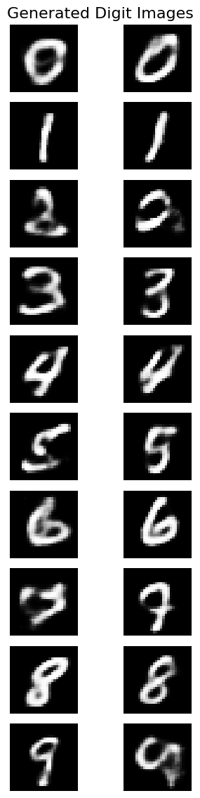

# GNR 638 Assignment 5

**Done by:**

- Aditya Anand (21D070007)
- Shounak Das (21D070068)

This repository contains the solution for Assignment 5 of the GNR 638 course.

Please use light mode in GitHub as in Dark mode, the plot axes and labels are not visible.

### Generated Images for each class (digit)

